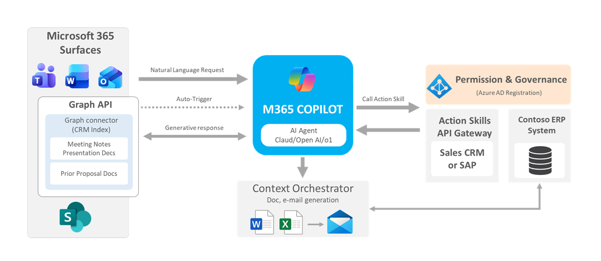

# Contoso Sales Proposal Agent (M365 Copilot Prototype)

A high-fidelity **simulation** of a Microsoft 365 Copilot Agent designed to transform the sales proposal workflow. This project validates the **Agentic Reasoning Loop**, **API Skill Integration**, and **M365 Surface Embedding**.

### **Live Demo Links**
* **Primary Demo (GenAI Integrated):** [https://mainak-demo-copilot.netlify.app/](https://mainak-demo-copilot.netlify.app/)
* **Fallback (Static Version):** [https://mainak-n.github.io/demo-copilot/](https://mainak-n.github.io/demo-copilot/)

---

## The Problem: "App-Switching Hell"
Creating a single sales proposal is currently a fragmented, manual process that bottlenecks revenue.
* **Workflow:** Sales reps switch between **6+ applications** (CRM, SharePoint, Outlook, Teams, Word, Excel).
* **Time Cost:** Average of **4-6 hours** per proposal.
* **Business Impact:**
    * annual revenue lost due to inefficiency.
    * lower win rate for delayed proposals.
    * High error rate due to manual copy-pasting.

---

## The Solution: Proposal Copilot
An intelligent agent built on the **Microsoft 365 Copilot Extensibility Platform** that lives where work happens.

### Core Capabilities
1.  **Email → Proposal:** Parses RFP emails in Outlook and auto-generates a first draft.
2.  **Smart Template Search:** Uses **Graph Connectors** to retrieve winning templates from SharePoint.
3.  **Intelligent Pricing:** Connects to ERP via **API Plugins** for real-time stock and rule-based pricing.
4.  **Collaboration Hub:** Manages approvals and "Human-in-the-Loop" reviews directly in Teams.

### Why M365 Copilot? (The 10x Advantage)
* **Standalone Apps:** Create yet another silo (2-3x improvement).
* **M365 Copilot Agent:** Inherits context (Emails, Chats, Meetings) and security (Entra ID), eliminating context switching entirely (**10x improvement**).

---

## User Personas
| Persona | Role | Pain Point | Need |
| :---- | :--- | :--- | :--- |
| **You** | Sales Executive | "I spend more time hunting for info than selling." | Speed, Template Discovery, Automation. |
| **Sarah Chen** | Account Manager | Lacks visibility into pipeline and approval delays. | Consistency & Compliance. |
| **David** | Solutions Engineer | Struggles with context handoff for technical sections. | Seamless collaboration on drafts. |

---

## Technical Architecture & M365 Integration
This prototype simulates the production architecture of a **Declarative Agent**.

### 1. Integration Touchpoints
* **Outlook:** RFP parsing, Adaptive Cards for leads, One-click drafts.
* **Teams:** @mention collaboration, Approval workflows, Proposal Dashboard.
* **Word:** Copilot-assisted drafting, Brand template enforcement.
* **SharePoint:** Centralized template library and permission-based storage.

### 2. Extensibility Stack
* **Orchestrator:** M365 Copilot (Intent Routing).
* **Agent Manifest:** Defines the "Sales Assistant" persona and instructions.
* **Graph Connectors:** Indexes legacy PDF proposals and SharePoint data (RAG).
* **API Plugins (OpenAPI):** Wraps the Contoso ERP (SAP/Dynamics) for `GET /inventory` and `GET /pricing`.

---

## Projected Impact & Metrics
| Metric | Current State | Future State (With Agent) |
| :--- | :--- | :--- |
| **Context Switching** | 5-8 apps/day | **1-2 windows** (Teams/Word) |
| **Time to Proposal** | 4-6 hours | **~1 hour** |
| **Monthly Output** | 40 proposals/rep | **~160 proposals/rep** (Projected) |
| **Win Rate** | Lower due to delays | **Higher** due to faster TAT & Accuracy |

---
